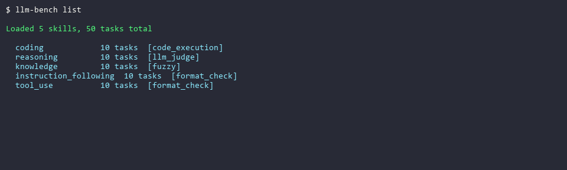
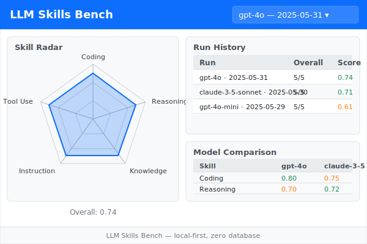
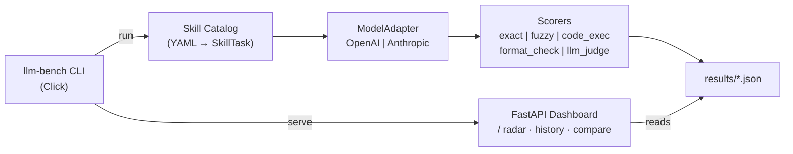

# LLM Skills Bench

A lightweight, self-hostable evaluation framework for measuring and tracking LLM performance across configurable skill dimensions.

  

---

## Demo

> Run `vhs demo.tape` to regenerate `demo.gif` (requires [vhs](https://github.com/charmbracelet/vhs))



---

## Quick Start

```bash
git clone https://github.com/your-org/llm-skills-bench
cd llm-skills-bench
pip install -e .

export OPENAI_API_KEY=sk-...   # or ANTHROPIC_API_KEY=sk-ant-...

llm-bench run --model gpt-4o --skills coding,reasoning
llm-bench serve --port 8080
```

---

## CLI Reference

| Command | Option | Default | Description |
|---|---|---|---|
| `run` | `--model` | required | Model name (`gpt-4o`, `claude-3-5-sonnet-20241022`, …) |
| `run` | `--skills` | all | Comma-separated skill filter |
| `run` | `--results-dir` | `./results` | Where to write JSON |
| `run` | `--judge-model` | same as `--model` | Model used for `llm_judge` scoring |
| `serve` | `--port` | `8080` | HTTP port |
| `serve` | `--results-dir` | `./results` | Directory to read results from |
| `list` | `--skills-dir` | built-in | Path to YAML catalog directory |

---

## Built-in Skills

| Skill | Scoring Method | # Tasks |
|---|---|---|
| **Coding** | Sandboxed `subprocess` test-case execution | 10 |
| **Reasoning** | LLM-as-judge on multi-step logic and math | 10 |
| **Knowledge** | Fuzzy string-match against reference answers | 10 |
| **Instruction Following** | Format compliance (JSON validity, word count, list structure) | 10 |
| **Tool Use** | Structured output and function-call schema parsing | 10 |

---

## Dashboard



The web dashboard (`llm-bench serve`) has three panels:

- **Skill Radar** — pentagon chart showing per-skill scores for the selected run
- **Run History** — scrollable table of all past runs (model · date · overall score)
- **Model Comparison** — side-by-side per-skill breakdown across two selected models

---

## Architecture



<details><summary>ASCII version</summary>

```
                ┌──────────────┐
  CLI ─────────▶│  run engine  │──▶ results/*.json
                └──────┬───────┘
                       │
          ┌────────────▼────────────┐
          │     ModelAdapter        │
          │  OpenAI | Anthropic     │
          └─────────────────────────┘
                       │
          ┌────────────▼────────────┐
          │     Skill Catalog       │
          │  YAML ──▶ Task objects  │
          └─────────────────────────┘
                       │
          ┌────────────▼────────────┐
          │      Scorer             │
          │  exact | fuzzy          │
          │  code_execution         │
          │  format_check           │
          │  llm_judge              │
          └─────────────────────────┘

  llm-bench serve ──▶ FastAPI dashboard (radar chart, history, comparison)
```

</details>

---

## Extending Skills

Add a custom benchmark in three steps.

**1. Create a YAML file** anywhere on disk (or alongside the built-in ones in
`src/llm_skills_bench/skills/`):

```yaml
# my_skills/summarisation.yaml
tasks:
  - task_id: summ_001
    skill: summarisation
    prompt_template: |
      Summarise the following text in exactly one sentence:

      {text}
    expected_output: null          # not required for llm_judge
    scoring_method: llm_judge
    difficulty: medium
    tags: [summarisation, fluency]
    metadata:
      criteria: "The summary is one sentence, accurate, and fluent."
      text: |
        The quick brown fox jumps over the lazy dog. Dogs are common
        household pets known for loyalty. Foxes are wild canids.
```

**2. Drop your YAML into the built-in directory or use `llm-bench list` to validate:**

```bash
# Verify tasks load correctly from a custom directory
llm-bench list --skills-dir ./my_skills

# Then copy to built-in directory and run
cp my_skills/summarisation.yaml src/llm_skills_bench/skills/
llm-bench run --model gpt-4o --skills summarisation
```

**3. Scoring methods at a glance:**

| `scoring_method` | When to use | `expected_output` required? |
|---|---|---|
| `exact` | Fixed single-token answers | Yes |
| `fuzzy` | Short free-text answers | Yes |
| `code_execution` | Python functions; set `metadata.test_code` | No |
| `format_check` | JSON keys, word limit, list structure | No |
| `llm_judge` | Open-ended quality; set `metadata.criteria` | No |

---

## Project Layout

```
llm-skills-bench/
├── src/llm_skills_bench/
│   ├── __init__.py
│   ├── cli.py          # Click CLI: run, serve, list
│   ├── schema.py       # Pydantic SkillTask model
│   ├── catalog.py      # YAML loader
│   ├── adapters.py     # ModelAdapter ABC + OpenAI/Anthropic + get_adapter()
│   ├── scorers.py      # exact, fuzzy, code_execution, format_check, llm_judge
│   ├── runner.py       # run_benchmark(), TaskResult, RunResult
│   ├── skills/         # YAML skill catalog — 50 tasks
│   ├── dashboard.py    # FastAPI app factory + API routes
│   └── templates/      # Jinja2 HTML template
├── assets/
│   └── dashboard.svg   # Dashboard screenshot
├── results/            # Timestamped JSON run outputs
├── demo.tape           # VHS script — run `vhs demo.tape` to generate demo.gif
└── tests/
    ├── test_scaffold.py
    ├── test_catalog.py
    ├── test_runner.py
    └── test_dashboard.py
```

---

## Roadmap

| Milestone | Status | Description |
|---|---|---|
| M1 | ✅ Done | Scaffold, README, pyproject.toml |
| M2 | ✅ Done | YAML skill catalog (50 tasks), `llm-bench list` |
| M3 | ✅ Done | Model adapters (OpenAI, Anthropic) + `run` command, scorers, JSON results |
| M4 | ✅ Done | FastAPI dashboard: radar chart, run history, model comparison |
| M5 | ✅ Done | Polish README, demo GIF, dashboard screenshot, Extending Skills guide |

---

## License

MIT — see [LICENSE](LICENSE).
